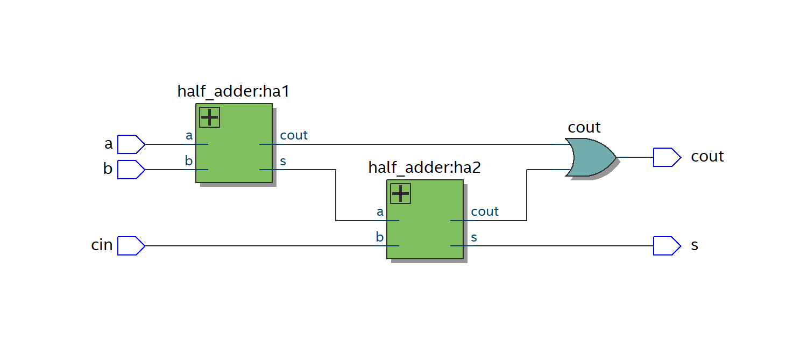
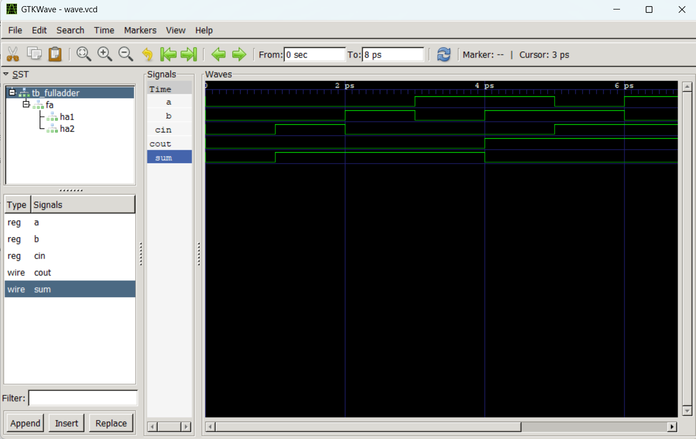
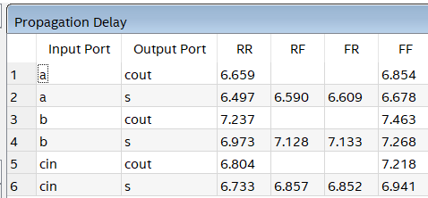

# Full Adder RTL Design

This project implements a 1-bit Full Adder using Verilog HDL. To demonstrate **Hierarchical Design** and **Structural Modeling**, this module is constructed by instantiating two fundamental Half Adder modules and an OR gate.

---

## 1. Specification
**Objective:** To design a combinational logic circuit that adds three 1-bit inputs (`a`, `b`, and carry-in `cin`) to produce two 1-bit outputs: `sum` and carry-out (`cout`).

**Truth Table:**

| a | b | cin | Sum | Cout |
|:-:|:-:|:---:|:---:|:----:|
| 0 | 0 |  0  |  0  |  0   |
| 0 | 0 |  1  |  1  |  0   |
| 0 | 1 |  0  |  1  |  0   |
| 0 | 1 |  1  |  0  |  1   |
| 1 | 0 |  0  |  1  |  0   |
| 1 | 0 |  1  |  0  |  1   |
| 1 | 1 |  0  |  0  |  1   |
| 1 | 1 |  1  |  1  |  1   |

**Logic Formulation:**
* $Sum = a \oplus b \oplus c_{in}$
* $Cout = (a \cdot b) + c_{in} \cdot (a \oplus b)$

---

## 2. RTL Implementation & Schematic
The architecture utilizes Structural Modeling by connecting two internal Half Adders. 
* **HA 1:** Adds input `a` and `b`.
* **HA 2:** Adds the sum of HA 1 and input `cin`.
* **OR Gate:** Combines the carry-out signals from both HAs.

Below is the synthesized gate-level schematic:

---

## 3. Verification & Simulation
**Tool:** GTKWave

An exhaustive Verilog testbench was developed to drive all 8 possible input combinations (from `000` to `111`). The simulation waveform verifies that the outputs precisely match the theoretical truth table:

---

## 4. Synthesis & Static Timing Analysis (STA)
**Tool:** Intel Quartus Prime

After successful synthesis, Static Timing Analysis (STA) was performed to evaluate the propagation delay of the Full Adder. 

According to the Datasheet Report below, the design exhibits a maximum propagation delay (Critical Path) of **7.463 ns**. This maximum delay occurs on the routing path from input `b` to output `cout` during a Fall-to-Fall (FF) signal transition.

