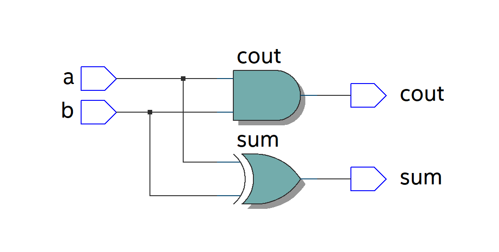
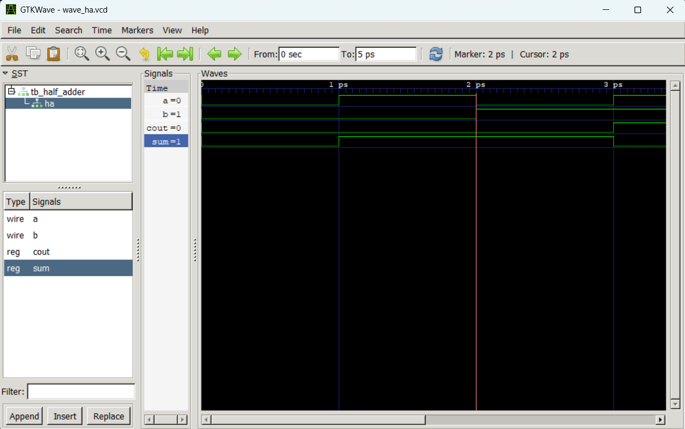

# Half Adder RTL Design

This project implements a basic Half Adder using Verilog HDL. It serves as a foundational module to demonstrate the digital design flow, from architectural specification and RTL coding to simulation-based verification.

---

## 1. Specification
**Objective:** To design a combinational logic circuit with two 1-bit inputs (`a`, `b`) that produces two 1-bit outputs: `sum` and `cout` (carry out).

**Truth Table:**

| Input a | Input b | Sum | Cout |
|:-------:|:-------:|:---:|:----:|
|    0    |    0    |  0  |  0   |
|    0    |    1    |  1  |  0   |
|    1    |    0    |  1  |  0   |
|    1    |    1    |  0  |  1   |

**Boolean Equations:**
* `Sum` = $a \oplus b$ (XOR Gate)
* `Cout` = $a \cdot b$ (AND Gate)

---

## 2. RTL Implementation & Schematic
Tool: Intel Quartus Prime

The module is described using continuous assignments in Verilog for optimal logic synthesis. Below is the gate-level schematic representing the design:

---

## 3. Verification & Simulation
Tool: GTKwave

The functional correctness of the design is verified using a Verilog testbench. The verification process employs exhaustive testing to cover all possible input combinations. 

The simulation waveform confirms that the `sum` and `cout` outputs respond correctly according to the theoretical truth table:

---

## 4. Synthesis & Static Timing Analysis (Optional)
*(Note: Placeholders for Fmax reports or Gate Netlist images can be added here once synthesized via tools like Quartus Prime or Vivado).*

---

## 5. Conclusion
The Half Adder module has been successfully designed and functionally verified. It is now ready to be instantiated in more complex architectures, such as a Full Adder or a Ripple Carry Adder.
