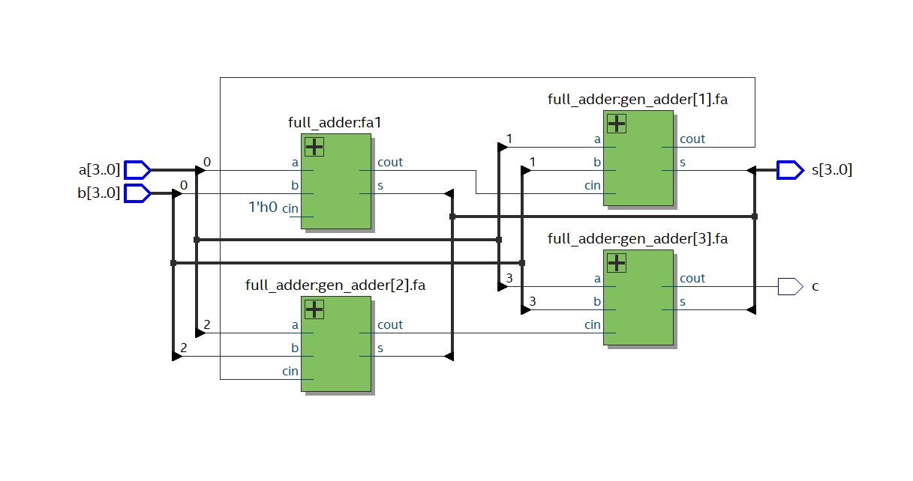
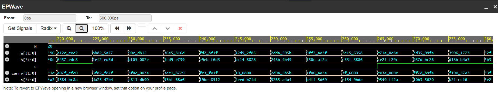
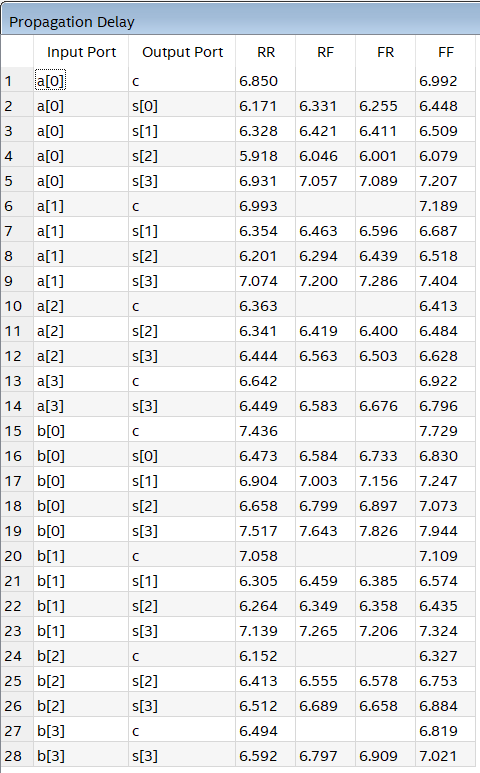

# Parameterized N-bit Ripple Carry Adder RTL Design

This project implements a parameterized N-bit Ripple Carry Adder (RCA) using Verilog HDL. It demonstrates the complete digital IC design flow, from structural architectural specification and RTL coding to automated simulation-based verification and logic synthesis.

---

## 1. Specification
**Objective:** To design a scalable N-bit arithmetic circuit that calculates the sum of two N-bit binary inputs (`a`, `b`), producing an N-bit output `s` (sum) and a 1-bit final output `c` (carry out).

**Architecture & Logic:**
The N-bit RCA is constructed by chaining $N$ Full Adder modules together. The carry-out of each bit stage connects directly into the carry-in of the subsequent, higher-order stage.
*   **Arithmetic Equation:** Sum = A + B
*   **Carry Chain:** $C_{in(i)}$ = $C_{out(i-1)}$

---

## 2. RTL Implementation & Schematic
**Tool:** Intel Quartus Prime

The module is described using a bottom-up hierarchical approach. A `generate` loop in Verilog automatically instantiates and connects the Full Adders based on the configured `parameter N`. Below is the gate-level RTL schematic representing the structural design for a **4-bit configuration**:

---

## 3. Verification & Simulation
**Tool:** Icarus Verilog & GTKWave / EPWave

The functional correctness of the design is verified using an automated Verilog testbench. The verification process employs randomized testing (applying 1,000 random test vectors) on a **32-bit configuration** to ensure logic robustness across a wide input space. 

The simulation waveform confirms that the 32-bit `s` and `c` outputs respond correctly to the inputs according to the mathematical addition model (monitored in Hexadecimal format):

---

## 4. Synthesis & Static Timing Analysis (STA)
**Tool:** Intel Quartus Prime

After successful synthesis, Static Timing Analysis (STA) was performed to evaluate the propagation delay of the sequential carry chain. 

The Datasheet Report below indicates that the maximum propagation delay (Critical Path) for the 4-bit configuration is **7.944 ns**, occurring on the path from the least significant input `b[0]` to the most significant output sum `s[3]`.

---

## 5. Conclusion
The parameterized N-bit Ripple Carry Adder has been successfully designed, fully verified via randomized test cases, and synthesized. It practically demonstrates the linear delay characteristics inherent to the ripple-carry architecture and is completely ready to be integrated into larger data path operations.
